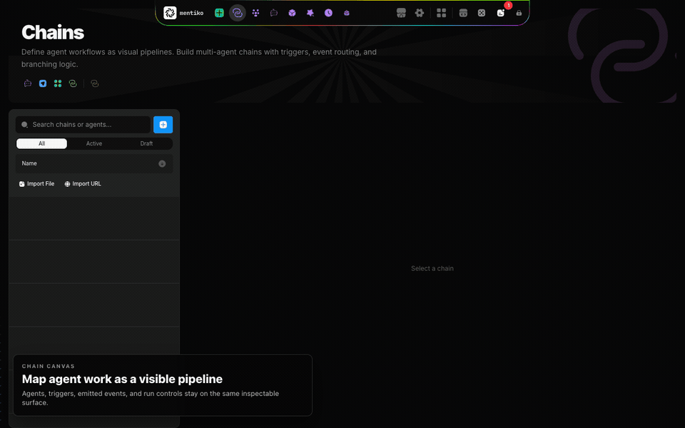

# Mentiko

<p align="center">
  
</p>

<p align="center">
  Self-hostable control surface for terminal-native AI agents.
</p>

<p align="center">
  <strong>Harness agent CLIs. See every handoff. Keep the work auditable.</strong>
</p>

<p align="center">
  <a href="LICENSE">Apache-2.0</a> ·
  <a href="SECURITY.md">Security</a> ·
  <a href="CONTRIBUTING.md">Contributing</a> ·
  <a href="docs/API_REFERENCE.md">API</a>
</p>

<p align="center">
  
</p>

Mentiko is an operations layer for agent harnesses. It runs terminal-native
tools like Claude Code, Codex, Kollabor, Aider, OpenCode, Gemini CLI, and custom
CLIs in managed PTY sessions, then gives that work a place to live: chains,
agent links, runs, decisions, tasks, artifacts, conversations, terminals, and
workspace files.

It is built for teams who want useful agent automation without losing sight of
the actual runtime. Sessions are real terminals, handoffs are explicit events,
outputs become artifacts, and completed runs can be inspected after the fact.

## What Mentiko Does

Mentiko is not trying to replace the agent CLIs people already like. It gives
them a harness:

- Run AI CLIs in isolated, inspectable PTY sessions.
- Chain agents together with explicit triggers, emitted events, and artifacts.
- Link two agents into debate, collaboration, or review loops with a moderator relay.
- Use guided decisions to research a question, compare options, approve a direction, and turn the result into tasks.
- Inspect live runs, terminal output, conversations, generated artifacts, file changes, schedules, and workspace context.
- Work in the browser with a built-in workspace code editor and live terminal interface.
- Operate local, SSH, and Docker workspaces with namespace, organization, and project scoped storage under `~/.mentiko`.
- Self-host the platform with container-oriented deployment assets.

## Feature Tour

| Feature | What it gives you |
| --- | --- |
| Agent harness runtime | Managed PTY sessions for Claude Code, Codex, Kollabor, Aider, OpenCode, Gemini CLI, and custom terminal tools |
| Visual chain orchestration | JSON chains with explicit triggers, emitted events, handoffs, retries, schedules, webhooks, and run history |
| Agent links | Two-agent debate, collaboration, and review sessions with per-agent profiles, moderator relay, escalation, transcripts, and run records |
| Decisions | AI-assisted decision workflows with research, tradeoff questions, tailored options, execution plans, task creation, and retrospectives |
| Live operations | Dashboard, activity feed, run detail views, terminal output, conversations, artifacts, file changes, metrics, logs, and status history |
| Workspace cockpit | Browser code editor, file tree, search-in-files, split panes, markdown preview, and an interactive terminal for each workspace |
| Workspaces | Local, SSH, and Docker execution contexts with scoped environment variables, secrets, and workspace-aware paths |
| Self-hosting | Better Auth, secret storage, audit logging, route coverage checks, process supervision, and tenant container packaging |

## Highlights

| Area | What you get |
| --- | --- |
| Agent runtime | PTY-backed sessions you can inspect, steer, pause, and resume |
| Chain orchestration | JSON chains with explicit triggers, emitted events, and handoffs |
| Agent collaboration | Pair agents in debate, collaboration, or review loops with human escalation when they get stuck |
| Web operations | Live run output, task state, conversations, artifacts, schedules, decisions, links, terminals, and code editing |
| Workspaces | Local, SSH, and Docker execution contexts |
| Security posture | Session-based auth, namespace/org/project data roots, secret storage, audit logging, and route coverage checks |
| Deployment | Container-oriented tenant packaging with build and rollback runbooks |

## Why It Exists

Most agent frameworks make the agent runtime feel far away. Mentiko keeps it
close. It is closer to an operations console than a magic assistant: you can
watch agents work, steer them, compare their outputs, preserve the trail, and
turn useful decisions into executable follow-up.

The core loop is intentionally simple:

```text
chain.json
  -> launch agent in PTY session
  -> agent does work in a workspace
  -> agent emits an event file
  -> Mentiko starts the next matching agent
  -> run history, output, artifacts, and task state are captured
```

## Status

Mentiko is in public beta. The platform is usable today, but the API, storage
layout, and deployment workflow are still moving quickly. Use it with normal
self-hosting discipline: keep backups, set production secrets, and review
workspace permissions before running untrusted chains.

This is the public platform repo. If you find stale internal docs, local machine
paths, or retired compatibility references, please open an issue or pull request
so they can be removed.

## Requirements

- macOS or Linux for local development
- Node.js 22 recommended
- Bash 4+
- Git
- At least one supported AI CLI installed and authenticated
- Docker or Podman for containerized/self-hosted deployments

## Quick Start

Clone the repo:

```bash
git clone https://github.com/kollaborai/mentiko.git
cd mentiko
```

Run the web app:

```bash
cd web
printf "BETTER_AUTH_SECRET=%s\n" "$(openssl rand -hex 32)" > .env.local
npm install
npm run dev
```

Open [http://localhost:3000](http://localhost:3000). On first run, choose
**Sign up** and create the first local account. That first account becomes the
workspace owner for this Mentiko instance, takes you to the dashboard, and opens
the setup wizard. After that, use **Sign in** with the same email and password.
Passwords must be at least 12 characters.

If SMTP is not configured during local development, verification and password
emails are printed in the dev server logs instead of being sent.

For production or shared deployments, set `BETTER_AUTH_SECRET`, configure the
correct public URL via `BETTER_AUTH_URL`, and keep runtime data outside the repo
under `~/.mentiko` or your configured data root.

Use the CLI from the repo root:

```bash
cd /path/to/mentiko
export PATH="$PWD/bin:$PATH"
mentiko --help
```

Run a chain:

```bash
mentiko run path/to/chain.json --workspace ~/projects/my-app
```

## Chain Example

Chains are JSON files with agents, triggers, and emitted events:

```json
{
  "name": "Research and Review",
  "description": "Research a topic, draft an answer, then review it.",
  "version": "1.0.0",
  "agents": [
    {
      "id": "researcher",
      "name": "Researcher",
      "triggers": ["manual-start"],
      "emits": "research-complete",
      "prompt": "Research {TASK} and write findings to workspace/research.md"
    },
    {
      "id": "reviewer",
      "name": "Reviewer",
      "triggers": ["research-complete"],
      "emits": "review-complete",
      "prompt": "Review the research and write recommendations."
    }
  ]
}
```

## Project Layout

```text
bin/      CLI tools, PTY manager wrapper, peer orchestration, secrets helpers
lib/      Bash and Node orchestration scripts, schemas, plugins, process manager
web/      Next.js app, API routes, components, stores, terminal bridge, tests
scripts/  Operations, backup, restore, smoke, and database utilities
tests/    Bash, Jest, and Playwright test harnesses
docs/     Architecture, security, deployment, API, and feature docs
```

Runtime data does not belong in the repo. Mentiko stores tenant data under:

```text
~/.mentiko/namespaces/{namespaceId}/...
```

## Web App

The web UI includes:

- Dashboard and activity feeds
- Chain builder and visual editor
- Agent library and templates
- Agent links for two-agent debate, collaboration, and review sessions
- Guided decisions that turn research and tradeoffs into approved tasks
- Runs, conversations, tasks, schedules, artifacts, file changes, and metrics
- Built-in workspace code editor with file tree, search, tabs, split panes, and markdown preview
- Browser terminal interface for live PTY sessions and workspace CLI auth
- Workspace management for local, SSH, and Docker execution
- Settings for auth, secrets, run profiles, agent configs, sessions, logs, metrics, and system diagnostics

## CLI

Common commands:

| Command | Purpose |
| --- | --- |
| `mentiko run <chain.json>` | Run a JSON chain |
| `mentiko launch <spec-file>` | Launch one markdown agent spec |
| `mentiko generate "<prompt>"` | Generate a chain from a natural-language prompt |
| `mentiko validate <chain.json>` | Validate a chain config |
| `mentiko graph <chain.json>` | Print a chain graph |
| `mentiko init [directory]` | Scaffold a starter project layout |
| `mentiko emit <event-name> <source>` | Emit an event |
| `mentiko list` | List active PTY sessions |
| `mentiko peek <session>` | Read session output |
| `mentiko send <session> "message"` | Send input to a live session |
| `mentiko kill <session>` | Stop a PTY session |
| `mentiko kill-all` | Stop all active PTY sessions |
| `mentiko events` | Inspect emitted events |
| `mentiko audit summary` | Summarize audit activity |

## Documentation

Start here:

- [Architecture](docs/architecture.md)
- [API reference](docs/API_REFERENCE.md)
- [Agent links](docs/peer-collaboration.md)
- [Decisions API](docs/DECISIONS_API.md)
- [Deployment](docs/deployment.md)
- [Configuration profiles](docs/CONFIG_PROFILES_SPEC.md)
- [Auth route coverage](docs/AUTH_COVERAGE.md)
- [Security deployment checklist](docs/SECURITY_DEPLOYMENT_CHECKLIST.md)
- [Troubleshooting](docs/troubleshooting.md)
- [Getting started tutorial](docs/tutorial/getting-started.md)
- [Release checklist](docs/RELEASE_CHECKLIST.md)

## Contributing

Contributions are welcome. Read [CONTRIBUTING.md](CONTRIBUTING.md), open an
issue or pull request, and include reproduction steps or screenshots for UI
changes whenever possible.

## License

Apache-2.0. See [LICENSE](LICENSE).
