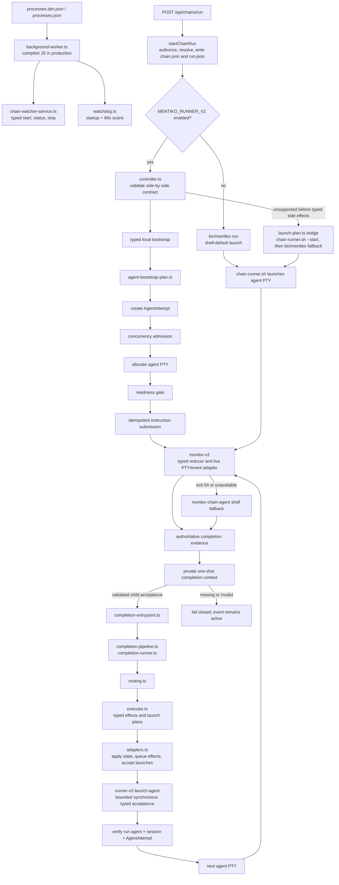
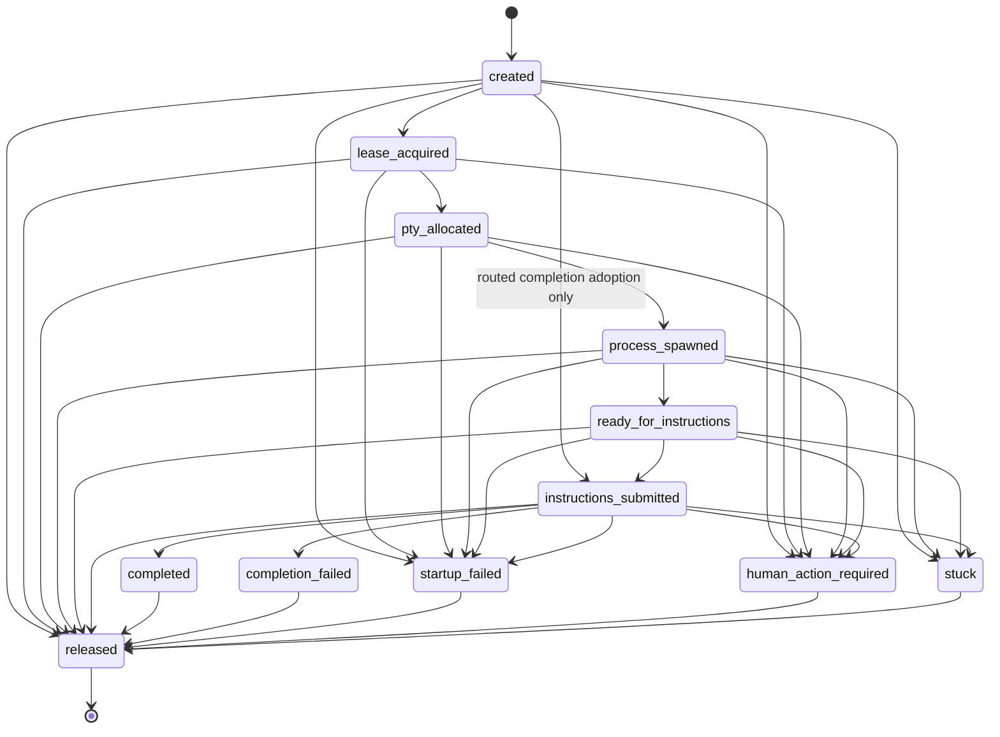

# Runner v2 architecture

Status: current working-tree architecture, verified 2026-07-14.

Runner v2 is Mentiko's typed orchestration path. It is a side-by-side migration,
not a complete replacement of the shell engine. The current system deliberately
mixes typed planning, state transitions, and background services with
shell-owned launch behavior while parity work continues.

This document describes the code that exists now. It does not claim that the
working tree is released or deployed. Runtime evidence still outranks this
document.

## Source of truth

Use these sources in this order:

1. Current code under `web/lib/runner-v2/`, `web/lib/runs/chain-run-service.ts`,
   `lib/chain-runner.sh`, and `lib/agent-functions.sh`.
2. `docs/orchestration/contracts/runner-v2-contract.json`, the machine-readable
   migration contract and implementation-coverage ledger.
3. This document, the human-readable architecture and lifecycle trace.
4. `docs/architecture.md` and `docs/orchestration/README.md`, which describe the
   wider platform and the shell engine runner v2 is replacing.

The contract is intentionally pinned to:

- `migration_mode: side-by-side`
- `default_runner: shell`
- `MENTIKO_RUNNER_V2` off by default
- `MENTIKO_RUNNER_V2_COMPLETION` off by default

`web/lib/runner-v2/contracts.ts` rejects changes to `migration_mode`,
`default_runner`, or either flag name. The JSON contract records both flags as
default-off, but that default value is not itself validated by `contracts.ts`.
Passing switch-readiness checks therefore proves parity coverage under the
side-by-side contract; it does not make runner v2 the default engine.

The contract ledger also retains baseline ownership rows for the shell
contracts alongside the newer `monitor-v2.contract.json` coverage. Treat those
rows as migration requirements, not as a global current-owner map; the live
imports and call path in code decide current ownership.

## The current shape



The typed path currently owns the initial local bootstrap, `AgentAttempt`
state, monitor reduction, completion reduction, routing decisions, effect
planning, locked TypeScript writes to `run.json`, and durable external-effect
queuing. Independently of each chain launch, the TypeScript background worker
owns chain-watcher start/status/stop and startup plus periodic watchdog scans.

The shell path still owns the default launch and non-local initial-launch
compatibility. Routed next-agent and parallel launches use the typed launcher
directly and fail closed without consuming the parent event when typed startup
cannot be durably accepted. The retired watchdog and chain-event-watcher
scripts are parity references, not active daemons.

## Runtime selection and fallback rules

### Launch selection

`web/lib/runs/chain-run-service.ts:startChainRun` always creates the run
directory, `run.json`, and the run-local `chain.json` before selecting an
engine.

When `MENTIKO_RUNNER_V2` is absent or false, it starts:

```text
/bin/zsh -lc "bin/mentiko run <run-dir>/chain.json ..."
```

When `MENTIKO_RUNNER_V2` is true, it calls
`web/lib/runner-v2/controller.ts:startRunnerV2Launch`.

The controller first calls `startRunnerV2Bootstrap`, which directly allocates
and drives the first agent PTY for local workspaces. If planning is unsupported
before typed side effects, fallback is allowed. The controller then uses
`buildRunnerV2LaunchPlan`, whose current implementation builds a detached shell
bridge:

```text
bash lib/chain-runner.sh <chain.json> --start <first-agent>
  || exec bin/mentiko run <chain.json>
```

`buildRunnerV2ShellCompatLaunchPlan` exists but is not the plan selected by
`buildRunnerV2LaunchPlan`.

Once the typed bootstrap has allocated sessions or mutated run state, failures
return `fallbackAllowed: false`. `startChainRun` then throws instead of starting
a second shell owner against the partially-started attempt.

The bridge's own `chain-runner.sh ... || exec bin/mentiko run ...` fallback is
still command-level. If `chain-runner.sh` exits nonzero after making partial
shell-side effects, the `bin/mentiko` leg can run; the controller's
`fallbackAllowed` guard only knows about typed-bootstrap side effects.

### Workspace boundary

The direct typed bootstrap currently supports only local workspaces.
`WORKSPACE_TYPE=ssh` or `docker` returns unsupported before side effects and
the initial controller may use the shell bridge. Routed launch has no shell
fallback: the typed launcher returns nonzero, the completion adapter leaves the
strict parent event active, and retry/reconciliation can attempt delivery again.

### Background service selection

Watcher and watchdog ownership does not depend on either runner-v2 flag and is
not an agent-bootstrap side effect. The process manager starts one background
worker:

- development: `npx tsx server/background-worker.ts`,
- production: `node server/background-worker.js`.

The worker starts `startChainWatcherService()`, includes
`getChainWatcherServiceStatus()` in its durable status, and awaits
`stopChainWatcherService()` during shutdown. It runs `runTypedWatchdogScan()`
once at startup and every 60 seconds with an in-flight guard, publishing scan
and PTY-transport state. No active launch path starts the retired shell daemon
sessions and there is no shell fallback for these services.

### Monitor selection

Monitor v2 is default-on inside both launch paths:

- `agent-bootstrap-plan.ts` sets `MENTIKO_MONITOR_V2` to `1` when unset.
- `chain-runner.sh` exports `MENTIKO_MONITOR_V2=${MENTIKO_MONITOR_V2:-1}` for
  shell initial/fallback agents.

The monitor command tries the compiled `lib/monitor-v2.js`, then the TypeScript
source through `tsx` in development. Exit code `64` means unsupported and
delegates to `lib/agent-functions.sh:monitor-chain-agent`. Other exit codes are
treated as handled outcomes.

### Completion selection

Completion is unconditionally typed. `MENTIKO_RUNNER_V2_COMPLETION=1` remains a
forced compatibility marker, not a selector. The monitor calls the typed PTY
launcher, which transfers allowlisted context through a private one-shot file
and requires child acceptance. Missing Node, a missing typed entrypoint,
malformed context, PTY rejection, missing acceptance, exit `64`, or typed
failure does not fall through to shell completion. The parent event remains
active and unacknowledged.

## One complete agent lifecycle

Assume a chain has two agents:

- `writer` starts manually and emits `draft.ready`.
- `reviewer` triggers on `draft.ready`.

The following is the exact happy path when both runner-v2 flags are enabled,
the workspace is local, the concurrency and readiness gates pass, monitor v2
is available and does not return `64`, `writer` produces an owned
`draft.ready` event, and no quality-gate, retry, loop, or fan-group branch
intercepts completion.

### 1. HTTP admission

`POST /api/chains/run` enters `web/app/api/chains/run/route.ts`.

The route:

1. blocks guest writes,
2. requires `manage_chains`,
3. resolves namespace and organization from the request,
4. parses the JSON body,
5. calls `startChainRun`.

### 2. Run materialization

`startChainRun` resolves the authenticated actor, authorized workspace,
chain-agent references, selected profile, secrets, and request-scoped session
token.

It mints or validates a run id, then writes:

```text
<runs-dir>/<run-id>/
  chain.json
  run.json
  output.log
```

`run.json` starts with every declared agent `pending`. The run status is
`running` unless the web-side cap observation marks it `pending` and queued.
The engine's concurrency gate remains the admission authority that promotes or
blocks the run.

Generation and decision runs also receive run-scoped import tokens under
`.internal/`.

### 3. Runner-v2 gate

`buildChildEnv` carries the runner-v2 flags plus the sanitized namespace,
organization, root, session, profile, workspace-environment, and internal
callback context. Workspace path and task id are passed separately in the
controller context; shell commands receive them as `--workspace` and `--task`
arguments.

`isRunnerV2Enabled(childEnv)` calls `startRunnerV2Launch`. The controller loads
and validates `runner-v2-contract.json`, then attempts direct typed bootstrap.

### 4. Bootstrap planning

`buildAgentBootstrapPlan` reads the run-local `chain.json`, resolves `writer`,
resolves its selected profile and readiness policy, and derives:

- the agent and monitor PTY names,
- project, artifacts, events, and state paths,
- the profile launch command,
- an instruction artifact and pointer,
- the monitor command and required environment.

Events default to the organization-scoped events directory, not a private
run-only directory, so the watcher and completion path see the same handoff.

### 5. Typed attempt creation and admission

`executeLocalBootstrap` does not start watcher or watchdog processes. Their
lifecycle is already owned by the independently supervised background worker.

It then creates `runnerV2.attempts[]` in `run.json` for `writer`:

```text
created
  -> lease_acquired
  -> pty_allocated
  -> process_spawned
  -> ready_for_instructions
  -> instructions_submitted
```

Every `run.json` mutation from the typed path uses
`web/lib/runs/run-json-lock.ts` through `updateRunJson`, followed by atomic
replacement.

Before PTY allocation, `acquireChainAdmission` applies the same chain-cap
contract as the shell gate. Cap expiry transitions the attempt to
`human_action_required` with `concurrency_cap_blocked` and launches no agent.

### 6. Agent PTY bootstrap

The bootstrap writes:

```text
artifacts/writer-instructions.md
artifacts/writer-start.sh
state/<session-prefix>-<run-id>.state
```

It removes a stale PTY with the target name, spawns a namespaced PTY, records
its PID and PTY session id as process evidence, registers the session in
`run.json`, and starts the profile command.

The readiness gate classifies the live CLI through the selected profile's
policy. A blocked readiness result writes diagnostic artifacts, marks the run
and attempt, leaves the agent PTY available for intervention, and does not send
instructions.

On readiness, instruction submission is recorded with an idempotency key
before the pointer is sent. `confirmInstructionSubmission` verifies that the
CLI accepted the pasted instruction. An unconfirmed composer transitions the
attempt to `stuck` with `instruction_submission_unconfirmed`; the monitor still
starts so completion or intervention remains observable.

### 7. Typed monitoring

`startMonitorSession` launches a companion PTY running `monitor-v2`.
`monitor-cli.ts` constructs `createLiveMonitorIO` and enters
`monitor.ts:runChainMonitor`.

Each monitor tick observes:

- whether the PTY session still exists,
- whether the local child process is alive,
- the hash of the last 20 terminal lines,
- stale and durable nudge counts,
- context-exhaustion evidence,
- authoritative completion evidence.

Completion evidence is one of:

1. the declared event for this run and agent,
2. a standalone durable `AGENT_COMPLETE` marker from the correctly identified
   profile transcript,
3. a compatible core-generation artifact with matching run, job, kind,
   freshness, token, canonical path, and payload contract.

Terminal classifications recheck the same evidence immediately before writing
failure or blocked state. An alive, producing agent without completion evidence
is not failed. Stalls are surfaced as blocked; context exhaustion is failed and
its unresumable PTY is removed.

### 8. Writer completion handoff

When `writer` produces `draft.ready`, monitor v2 latches the evidence and starts
a separate completion PTY. Completion cannot run inside the monitor PTY because
terminal cleanup removes the monitor session.

With both runner-v2 flags enabled, the completion PTY invokes
`complete-cli.ts`, which calls `runRunnerV2CompletionEntrypoint`.

### 9. Typed completion reduction

The completion entrypoint:

1. resolves `run.json`, `chain.json`, the active agent, state, and events,
2. detects fan-group membership,
3. rejects already-applied duplicate completion,
4. snapshots run, event, and typed/shell loop state for dry-run or failure
   restoration,
5. reuses the bootstrap-created `AgentAttempt` for `writer`,
6. applies quality-gate handling before normal routing,
7. calls `runCompletionPipeline`.

`completion-runner.ts:completeAgent` matches `draft.ready`, writes `writer` as
`complete`, and transitions the typed attempt to:

```text
instructions_submitted -> completed
terminalReason: completed_from_event
```

It calls `routing.ts:decideNextRoute(chain, "draft.ready")`. For this
single-trigger example, `reviewer` is runnable and the decision is:

```text
action: launch
agentIds: [reviewer]
```

### 10. Effect and launch planning

`executor.ts:buildTypedExecutorPlan` turns the routing decision into:

- event-processing and archive effects,
- agent-completion plugin, notification, and webhook operations,
- fan-group state when applicable,
- a direct typed routed-launch invocation with explicit acceptance targets.

`adapters.ts:applyTypedExecutorPlan` applies local state changes immediately.
Network, plugin, notification, webhook, and task-status operations are appended
to `state/external-effects.jsonl`; the background worker claims, retries, audits,
and drains that outbox. Enqueue and claim rename share one filesystem claim, and
every operation carries a stable ID through pending, claimed, and audit records.
Replay skips completed IDs; the notification and task sinks also apply that ID
idempotently across a crash between local delivery and audit. Plugins and
webhooks remain at-least-once because their remote side effects cannot share the
local commit: plugins receive `MENTIKO_EXTERNAL_EFFECT_ID`, metadata webhooks
receive `data.idempotencyKey`, and legacy webhooks receive `Idempotency-Key` so
the consumer can suppress duplicates.

Direct synchronous completion operations use the same accepted completion
occurrence as their replay boundary. Canonical event emission, schedule history,
session-policy audit, and rollback audit persist stable operation receipts under
owner-bearing typed claims; replay of that occurrence does not append or emit
again, while a later loop or attempt occurrence remains independent. Event
emission also records `state/completion-event-emissions.jsonl`, so consuming or
archiving the active event cannot make parent completion replay emit it again.
Executable hooks record `dispatching` then `dispatched` and receive the stable
key in both environment and details. Their crash window is explicitly
at-least-once: a process death after spawn but before the dispatched receipt may
redeliver, and the hook must dedupe by that key if it requires exactly-once work.

### 11. Durable typed handoff to the next agent

For `reviewer`, `buildRoutedLaunchPlans` creates:

```text
node lib/runner-v2-launch-agent.js <run-dir>/chain.json reviewer
```

The adapter invokes that CLI synchronously with a bounded timeout. The CLI calls
`startRunnerV2Bootstrap` for each exact target and exits only after startup is
accepted or rejected. A zero exit is necessary but not sufficient: the adapter
then re-reads `run.json` and requires each target to have a matching run agent,
session, and `AgentAttempt` in an accepted running or blocked phase.

The parent completion event stays active through local effects and launch
acceptance. A spawn error, timeout, nonzero exit, or missing durable state throws
before event consumption. On replay, already-accepted durable target state
suppresses relaunch and the still-active parent event is consumed once. Fan-in
claim state is committed only after the typed target passes the same acceptance
gate.

New launches do not write `runnerV2.pendingHandoffs`. That array is pre-cutover
evidence retained only so registration and reconciliation can clear old records.

### 12. Reviewer returns to typed completion

When `reviewer` completes, its typed bootstrap monitor carries
`MENTIKO_RUNNER_V2` and `MENTIKO_RUNNER_V2_COMPLETION`. The completion handoff
therefore returns to `runRunnerV2CompletionEntrypoint` with the attempt created
during routed bootstrap. `adoptAgentAttemptForCompletion` reuses that record.

Only a pre-cutover shell-routed agent without attempt evidence is adopted
directly at `instructions_submitted` with:

```text
origin: routed-completion-adoption
```

The real completion verdict then performs the normal
`instructions_submitted -> completed` or `completion_failed` transition. The
legacy adoption record does not fabricate startup transitions it never observed.

## AgentAttempt state machine

The transition validator allows the following paths. Routed completion
adoption is the one special persisted edge: it writes a provenance-marked
`created -> instructions_submitted` history directly because the typed runtime
did not observe the intervening shell-owned startup phases.



Terminal reason and process evidence stay on the attempt. When
`releaseAgentAttempt` is called, it records a separate release reason rather
than overwriting why the attempt originally ended. Current successful
completion cleanup removes the monitor and agent sessions but does not call
`releaseAgentAttempt`; a normally completed attempt therefore remains
`completed`, not `released`.

## Persistent state and evidence

The runtime is file-backed. The important surfaces are:

- `<run-dir>/run.json`: canonical run, agent, `runnerV2.attempts`, and stuck
  events. Historical `pendingHandoffs` may remain until typed cleanup retires them.
- `<run-dir>/chain.json`: run-local chain snapshot used by launch, monitor,
  completion, and routed relaunch.
- `<run-dir>/artifacts/`: instruction, startup, capture, generation, quality,
  and recovery evidence.
- `<run-dir>/state/` or the configured `STATE_DIR`: fan groups, retry state,
  outbox records, dispatch audit, cleanup evidence, and loop state.
- the one configured absolute event root: declared agent events and diagnostic
  events. Completion does not probe inferred project or run-local alternatives.
- `~/.mentiko_monitor/`: monitor hashes, stale counters, durable nudge budgets,
  completion latches, and process-arming state.
- `launches.log` and `fanout-<agent>.log`: bounded typed routed-launch output.

## Typed ownership and shell ownership

Typed today:

- web request selection and run materialization,
- first-agent local bootstrap,
- `AgentAttempt` validation and evidence,
- locked TypeScript `run.json` mutations,
- monitor-v2 reduction and completion-evidence probing,
- typed completion verdicts,
- retry, fan-group, loop, terminal, and routing plans,
- synchronous routed-agent launch and durable acceptance verification,
- event ownership and archive planning,
- durable external-effect outbox and dispatcher,
- background-worker chain-watcher start, status, and stop,
- startup and periodic typed watchdog scans with durable status,
- completion recovery and switch-readiness checks.

Shell-owned today:

- the default chain launch,
- non-local agent launch,
- several observability, profile, transport, and workspace compatibility paths.

## Known current gaps

### Multi-trigger routing still lacks fired-event context for OR merges

`completion-entrypoint.ts` hydrates chain-agent status and latest-attempt time
from `run.json`, so an AND-style merge can see completed upstream emitters.

Mutually-exclusive OR merges need more than status. They need the set of events
that actually fired, because an upstream branch's static `emits` field cannot
describe which conditional path ran. The current routing call does not receive
that fired-event set.

Single-trigger routing, including the `writer -> reviewer` lifecycle above,
does not depend on this missing merge context.

### Some launch boundaries remain shell-owned

Initial unsupported/non-local launch may still use the shell compatibility
bridge. Typed `next-chain` currently invokes `chain-runner.sh` synchronously and
checks its exit, and retry delay is still represented as a generated shell
command. Same-run routed local agents use the typed launcher and full
`AgentAttempt` startup evidence without a shell fallback.

### The default engine is still shell

Runner-v2 readiness and proof artifacts do not change the contract default.
Do not describe runner v2 as the shipped default until the contract, runtime
configuration, and observed deployment all agree.

### Historical proof artifacts are not fresh runtime proof

`runner-v2-runtime-proof.json` and `runner-v2-watched-proof.json` are committed
evidence snapshots. They are useful as test contracts, not proof that today's
checkout or deployment exercised the same path. A current claim requires a
fresh run and inspection of `runnerV2.attempts`, process evidence, events,
launch logs, and terminal state.

## How to inspect a real lifecycle

For a current run directory:

```bash
jq '{id,status,agents,runnerV2}' <run-dir>/run.json
jq '{name,agents,branches,config}' <run-dir>/chain.json
ls -la <run-dir>/artifacts <run-dir>/state
tail -n 200 <run-dir>/output.log
tail -n 200 <run-dir>/launches.log
tail -n 200 <run-dir>/state/external-effects.jsonl
tail -n 200 <run-dir>/state/external-effects.dispatch.jsonl
```

For PTY truth, derive the namespaced daemon from the active namespace and
organization, then inspect that daemon rather than the default `p list`.

Minimum proof for one successful typed lifecycle:

1. the initial attempt reaches `completed`,
2. its `terminalReason` matches the accepted evidence,
3. process evidence names the real PTY and PID,
4. the declared event is owned by the run and agent,
5. the routed launch appears in `launches.log`,
6. the next agent has a matching session and accepted `AgentAttempt` in the same
   `run.json` before the parent event is consumed,
7. the next agent becomes `running` or explicitly `blocked`,
8. the next agent's completion advances that typed attempt,
9. queued external effects are drained or explicitly remain pending,
10. the final run and linked task state agree.

## Code map

Entry and selection:

- `web/app/api/chains/run/route.ts`
- `web/lib/runs/chain-run-service.ts`
- `web/lib/runs/child-env.ts`
- `web/lib/runner-v2/flags.ts`
- `web/lib/runner-v2/controller.ts`
- `web/lib/runner-v2/contracts.ts`

Bootstrap and attempt lifecycle:

- `web/lib/runner-v2/agent-bootstrap-plan.ts`
- `web/lib/runner-v2/bootstrap-executor.ts`
- `web/lib/runner-v2/agent-attempt.ts`
- `web/lib/runner-v2/readiness-policy.ts`
- `web/lib/runner-v2/run-state.ts`
- `web/lib/runs/run-json-lock.ts`

Monitoring:

- `web/lib/runner-v2/monitor-cli.ts`
- `web/lib/runner-v2/monitor.ts`
- `web/lib/runner-v2/monitor-reducer.ts`
- `web/lib/runner-v2/monitor-live-io.ts`
- `web/lib/runner-v2/monitor-io.ts`
- `web/lib/runner-v2/monitor-diagnostics.ts`
- `web/lib/runner-v2/monitor-types.ts`

Completion, routing, and effects:

- `web/lib/runner-v2/complete-cli.ts`
- `web/lib/runner-v2/completion-entrypoint.ts`
- `web/lib/runner-v2/completion-pipeline.ts`
- `web/lib/runner-v2/completion-runner.ts`
- `web/lib/runner-v2/completion.ts`
- `web/lib/runner-v2/routing.ts`
- `web/lib/runner-v2/routed-launch-plan.ts`
- `web/lib/runner-v2/executor.ts`
- `web/lib/runner-v2/adapters.ts`
- `web/lib/runner-v2/external-effects.ts`
- `web/server/background-worker.ts`
- `web/lib/runner-v2/event-side-effects.ts`
- `web/lib/runner-v2/fan-group-store.ts`
- `web/lib/runner-v2/loop-state.ts`
- `web/lib/runner-v2/retry-plan.ts`
- `web/lib/runner-v2/terminal-plan.ts`
- `web/lib/runner-v2/handoff-liveness.ts`

Background services:

- `web/server/background-worker.ts`
- `web/lib/runner-v2/chain-watcher-service.ts`
- `web/lib/runner-v2/watchdog.ts`
- `web/lib/system/background-worker-state.ts`
- `web/processes.dev.json`
- `web/processes.json`

Shell bridges:

- `lib/chain-runner.sh`
- `lib/agent-functions.sh`
- `lib/scheduler.sh`

Legacy watcher/watchdog parity references (not launched):

- `lib/watchdog.sh`
- `lib/chain-event-watcher.sh`

Readiness and recovery:

- `web/lib/runner-v2/switch-readiness.ts`
- `web/lib/runner-v2/completion-recovery.ts`
- `web/lib/runs/run-reconciler.ts`
- `web/app/api/tasks/reconcile/route.ts`
