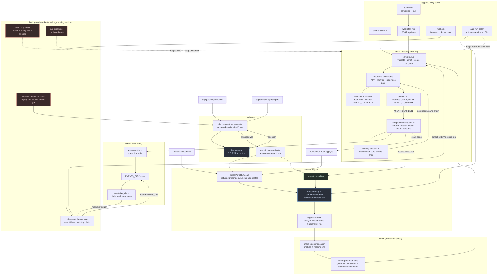
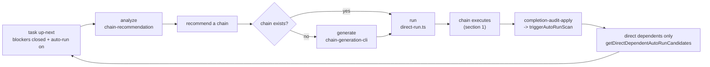
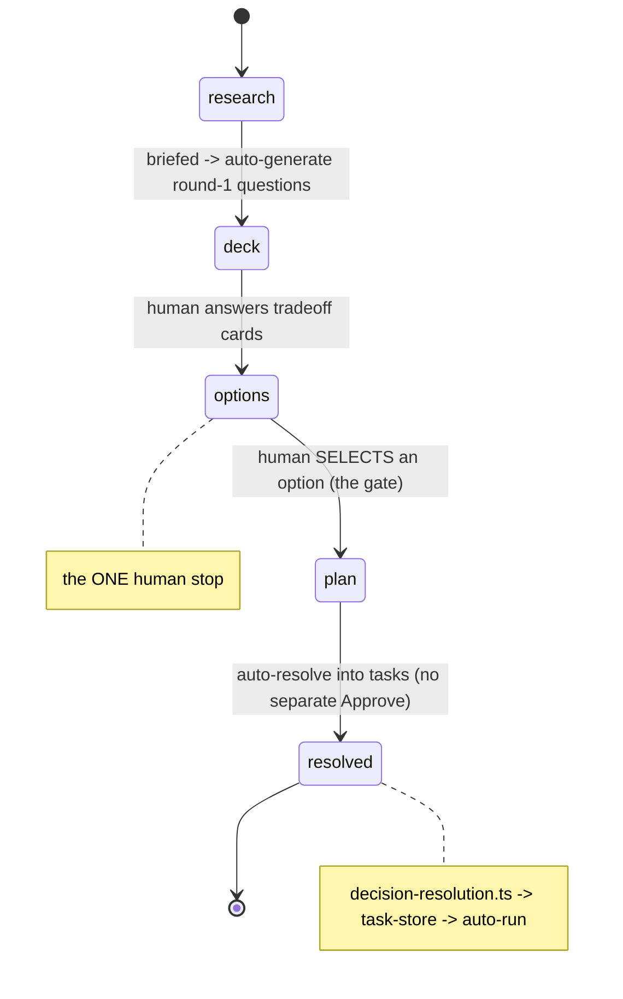

# engine map — how everything is wired

A single visual topology of the mentiko engine: triggers, watchers/monitors, chain
runner, chain generation, task creation, and decisions — and where an edge may lead
nowhere. Built 2026-07-24 and **verified against live code** (every named symbol grepped
to a real file; see "verified symbols" at the bottom).

The per-component ownership specs live in [contracts/](./contracts/) (chain-runner,
watcher-watchdog, runner-v2, monitor-v2). Those say *what each box owns*; this doc is the
*connective tissue between the boxes* they don't show. Prose sources: [README.md](./README.md)
and the "auto-run automation" contract in `mentiko/CLAUDE.md`.

---

## 1. full engine topology

Reaper boxes are red, human gates blue, the task store green.

---

## 2. within-task auto-run pipeline

One "up-next" task with no chain pulls **itself** through the whole pipeline, one step per
poller tick (`triggerAutoRun` in `web/app/api/tasks/auto-run/route.ts`):

**Landmine (documented):** never wire a *full-org* scan into close/reconcile — that recursed
into the TASK-097 re-run storm. Propagation is **dependents-only** on purpose.

---

## 3. decision phase machine

A person's single action — the selection — is the one and only gate; everything else
auto-advances server-side (`decision-auto-advance.ts`, driven by job-complete, decision-import,
and the 60s reconciler).

---

## 4. dead-ends & things to verify

Where an edge may lead nowhere — the reason this map exists. Not all are bugs; each is a
"confirm a consumer" item.

- **four overlapping reapers.** `watchdog` (stalled running), `run-reconciler` (orphaned),
  `reapDeadRuns` (inside the auto-run poller, >45m no liveness), and `decision-reconciler`
  (dead generation) all terminalize runs on different criteria. Confirm they don't fight each
  other (double-terminalize / one undoing another) and that every "dead run" class is owned by
  exactly one. This is the single most likely place a connection is redundant or contradictory.
- **`.bak` files in a live route.** `web/app/api/tasks/reconcile/route.ts.bak` and
  `route.test.ts.bak` sit next to the live route. Dead files in the tree — delete or restore,
  don't leave ambiguous.
- **known env-derivation bugs (from CLAUDE.md).** `CHAIN_PROJECT_ROOT` also derives data paths
  for non-local workspaces; `REMOTE_PROJECT_ROOT` writes artifacts to the project dir instead of
  `$RUNS_DIR`; `REMOTE_NAMESPACE_ROOT` creates dirs under project, not namespace. These are edges
  that land in the wrong directory — the #1 recurring "namespace path mismatch" class.
- **generation -> run handoff.** `/api/chains/recommend` runs the shared helper but is
  "unwatched live" (per the TASK-203 handoff). Confirm a generated chain actually reaches
  `direct-run` on the recommend path, not just the auto-run path.
- **GridBloom (now orphaned).** `web/components/ui/grid-bloom.tsx` has zero importers after the
  2026-07-24 tasks-banner revert. Dead component — safe to delete.

---

## verified symbols (2026-07-24, grepped to live files)

| symbol | file |
|---|---|
| `triggerAutoRun` / `triggerAutoRunScan` | `web/lib/tasks/completion-audit-apply.ts` |
| `getDirectDependentAutoRunCandidates` | `web/lib/runs/auto-run.ts` |
| `canAdmitAutoRun` / `resolveAutoRunState` | `web/lib/tasks/task-store.ts`, `auto-run-state.ts` |
| `isTaskReady` / `reapDeadRuns` | `web/app/api/tasks/auto-run/route.ts` |
| `advanceDecisionAfterPhase` | `web/lib/decisions/decision-auto-advance.ts` |
| `applyDecisionRunResult` | `web/lib/decisions/decision-run-results.ts` |
| chain-watcher / watchdog / reconcilers | `web/server/background-worker.ts` |

three propagation sites calling `triggerAutoRunScan`: `completion-audit-apply.ts`,
`api/tasks/reconcile/route.ts`, `decisions/decision-resolution.ts`.
